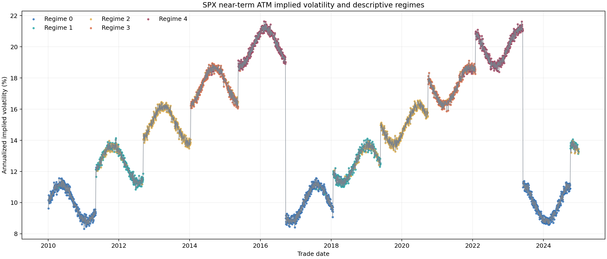
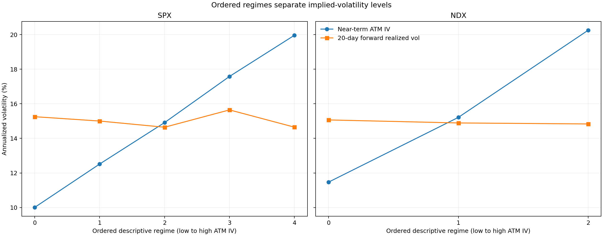
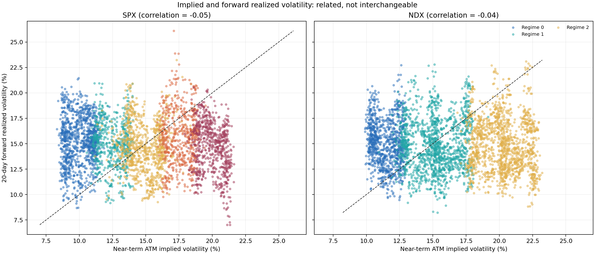

# Volatility regimes are easy to find. Forecast value is harder.

An option surface rarely moves as one number. At-the-money implied volatility can rise while the skew steepens, the wings change shape, and short maturities reprice faster than longer ones. Calling the whole episode “high volatility” throws away most of that structure.

This project asks a narrower question: if I compress the daily SPX and NDX option surfaces into a small feature vector, can latent states improve forecasts of the next 20 trading days of realized volatility?

The code has two parts. A descriptive pipeline finds states in the complete sample. A walk-forward pipeline refits on past data, predicts one block at a time, and compares a regime forecast with current at-the-money implied volatility, trailing realized volatility, and linear regression. Keeping those parts separate matters. A clean cluster plot is evidence that the surface has structure. It is not evidence that the structure forecasts anything.

The repository ships portable demo data for 3,912 trading days from 2010-01-04 through 2024-12-31. The results below describe that tracked sample. They should not be read as a production study based on independently sourced vendor history.

## A daily surface in seven numbers

Let $\sigma_t(\Delta,\tau)$ denote annualized implied volatility on trade date $t$, at signed option delta $\Delta$ and maturity $\tau$. Delta is a scale-free coordinate: a 25-delta option occupies a comparable part of the surface even when the index level changes.

For each date, the feature builder chooses the expiry nearest 30 days inside a 15-to-45-day bucket and the expiry nearest 90 days inside a 45-to-120-day bucket. It linearly interpolates along delta, then records seven values:

$$
\begin{aligned}
\mathrm{ATM}_{t,\mathrm{near}} &= \sigma_t(-0.50,\tau_{\mathrm{near}}), \\
\mathrm{ATM}_{t,\mathrm{mid}} &= \sigma_t(-0.50,\tau_{\mathrm{mid}}), \\
\mathrm{Skew}_{t,\tau} &= \sigma_t(-0.25,\tau)-\sigma_t(+0.25,\tau), \\
\mathrm{Butterfly}_{t,\tau} &= \frac{\sigma_t(-0.25,\tau)+\sigma_t(+0.25,\tau)}{2}-\sigma_t(-0.50,\tau), \\
\mathrm{TermSlope}_t &= \mathrm{ATM}_{t,\mathrm{mid}}-\mathrm{ATM}_{t,\mathrm{near}}.
\end{aligned}
$$

Here, $\mathrm{ATM}$ means at-the-money implied volatility, $\mathrm{Skew}$ measures how much richer the put wing is than the call wing, and $\mathrm{Butterfly}$ is a simple curvature proxy. The near and mid values of ATM, skew, and butterfly contribute six features. The term slope is the seventh.

The interpolation is deliberately modest. If the requested delta lies outside the observed range, the function returns a missing value instead of extrapolating a wing it cannot see.

```python
delta_fraction = (target_delta - delta_low) / (delta_high - delta_low)
interpolated_iv = iv_low + (iv_high - iv_low) * delta_fraction

skew_value = put_wing_iv - call_wing_iv
butterfly_value = 0.5 * (put_wing_iv + call_wing_iv) - atm_iv
term_slope = atm_iv_mid - atm_iv_near
```

## What the latent state model does

Each feature column is standardized using its sample mean and standard deviation. Let $x_t$ be the resulting seven-dimensional feature vector. A Gaussian mixture model with $K$ components assigns density

$$
p(x_t)=\sum_{k=1}^{K}\pi_k\,\mathcal{N}(x_t\mid\mu_k,\Sigma_k),
$$

where $\pi_k$ is the probability weight of component $k$, $\mu_k$ is its mean vector, $\Sigma_k$ is its full covariance matrix, and $\mathcal{N}$ is the multivariate normal density.

The code fits candidate counts from $K=2$ through $K=6$. It selects the smallest Bayesian information criterion (BIC):

$$
\mathrm{BIC}_K=-2\ell_K+p_K\log n,
$$

where $\ell_K$ is the fitted log-likelihood, $p_K$ is the number of estimated parameters, and $n$ is the number of daily observations. The penalty prevents likelihood from rewarding extra states without limit.

Mixture labels have no natural order, so the project sorts them by mean near-term ATM implied volatility. Regime 0 is the lowest implied-volatility state. Larger labels indicate successively higher average ATM implied volatility. The ordering improves interpretation, but it does not turn an unsupervised cluster into a risk forecast.



The full-sample SPX fit selects five components. The state colours follow the large level cycles in the portable data, and the labels separate ATM implied volatility almost mechanically. This is expected because near-term ATM implied volatility is the first model input and the ordering variable.

## The forecast target, step by step

Let $P_t$ be the index close on trading day $t$. First compute the daily log return:

$$
r_t=\log\left(\frac{P_t}{P_{t-1}}\right).
$$

For a horizon of $h$ trading days, collect the future returns $r_{t+1},\ldots,r_{t+h}$ and calculate their sample standard deviation:

$$
s_t(h)=\operatorname{std}\left(r_{t+1},\ldots,r_{t+h}\right).
$$

Finally, let $A$ be the number of trading days used for annualization. The project uses $A=252$, so forward realized volatility is

$$
\mathrm{RV}_t(h)=s_t(h)\sqrt{A}.
$$

The default horizon is $h=20$. Every quantity in the calculation is a decimal. A value of $0.15$ means 15 percent annualized volatility.

For a predicted ordered state $z_t$, the regime model forecasts the training-sample mean target in that state. Let $\mathcal{T}_t$ be the set of training dates available before forecast date $t$. Then

$$
\widehat{\mathrm{RV}}^{\mathrm{regime}}_t
=
\frac{
\sum_{u\in\mathcal{T}_t}\mathbf{1}\{z_u=z_t\}\mathrm{RV}_u(h)
}{
\sum_{u\in\mathcal{T}_t}\mathbf{1}\{z_u=z_t\}
},
$$

where $\mathbf{1}\{\cdot\}$ equals one when its condition is true and zero otherwise. This forecast is intentionally simple. Any gain has to come from state membership, not from a flexible forecasting layer hidden behind it.

## The embargo that makes the split honest

A chronological split can still leak. The label attached to a training date $t$ uses returns through $t+h$. If the test window begins before that target window ends, the model trains on returns belonging to the test period.

Let $i(d)$ be the integer position of date $d$ in the sorted price history, and let $s$ be the first test date. A training label is safe only when

$$
i(t)+h<i(s).
$$

The engine removes every training row that fails this inequality. With a 20-day target, that creates a 20-trading-day gap between the last usable training label and the first test observation.

```python
test_start_position = price_date_positions[test_index[0]]
safe_train_dates = []

for train_date in train_index:
    forward_window_end = price_date_positions[train_date] + horizon
    if forward_window_end < test_start_position:
        safe_train_dates.append(train_date)
```

This detail does more for credibility than another state model. Without it, an expanding window looks causal while its labels quietly cross the boundary.

## What the portable sample says

I regenerated the descriptive analysis from the tracked Parquet files with `blog/generate_charts.py`. The script applies the same seven feature definitions, standardization, full-covariance Gaussian mixtures, five initializations, random seed 42, and BIC selection used by the package.

| Symbol | Selected K | Lowest-regime ATM IV | Highest-regime ATM IV | Lowest-regime forward RV | Highest-regime forward RV |
|:--|--:|--:|--:|--:|--:|
| SPX | 5 | 10.01% | 19.96% | 15.25% | 14.65% |
| NDX | 3 | 11.47% | 20.26% | 15.07% | 14.83% |



The blue lines rise by construction: regimes are ordered on near-term ATM implied volatility. The orange lines do not. Mean 20-day forward realized volatility stays near 15 percent across the states in this demo sample. For SPX it is slightly lower in the highest state than in the lowest. NDX is nearly flat.

The variance risk premium in this project is the difference between ATM implied volatility and forward realized volatility. In the lowest SPX state, its sample mean is −5.24 percentage points. In the highest state, it is +5.31 percentage points. Most of that swing comes from implied volatility, not from a matching change in subsequent realized volatility.



The scatter tells the same story without aggregation. The sample correlation between current near-term ATM implied volatility and 20-day forward realized volatility is −0.05 for SPX and −0.04 for NDX. These values are properties of the portable demo data, not estimates I would carry into trading or risk limits. They do show why a regime chart cannot answer the forecast question on its own.

## Why there is no out-of-sample victory table

The default configuration requests a 3,880-row initial training window. Each symbol has 3,912 complete feature rows. The 20-day forward target removes the last 20 rows, and the trailing-realized-volatility benchmark requires a 20-day history at the beginning. After both alignments, 3,872 rows remain. That is fewer than the minimum training size, so the configured walk-forward run correctly writes an empty forecast panel.

Changing the threshold after seeing this would manufacture a result for the article. I left the research configuration untouched.

When forecasts exist, the reporting layer calculates root mean squared error (RMSE), mean absolute error (MAE), and an out-of-sample score relative to the ATM implied-volatility benchmark. Let $\mathrm{MSE}_{m}$ be model $m$'s mean squared error and $\mathrm{MSE}_{\mathrm{ATM}}$ the benchmark error on the same dates. The relative score is

$$
R^2_{\mathrm{OOS},m}=1-\frac{\mathrm{MSE}_{m}}{\mathrm{MSE}_{\mathrm{ATM}}}.
$$

A positive value means model $m$ reduces squared error versus current ATM implied volatility. Zero means a tie. A negative value means the supposedly richer model is worse.

## The experiment I would run next

The next run needs enough untouched observations to judge the models. I would set the initial window before looking at errors, keep the 20-day embargo, and report results by contiguous time block rather than only as one pooled score. A regime method that wins only in one smooth portion of the portable series is not dependable evidence.

I would also compare feature sets already registered in the package: ATM only, ATM plus term structure, ATM plus skew, the near-expiry smile, and the full seven-feature vector. That comparison asks whether surface shape adds information beyond the volatility level that defines the state ordering.

The project gets the research order right. Extract the surface, find interpretable states, define a future target, remove overlapping labels, and then compare against simple forecasts. The current tracked sample supports the first two steps and exercises the machinery for the others. It does not yet support the claim that latent volatility regimes improve realized-volatility forecasts.
