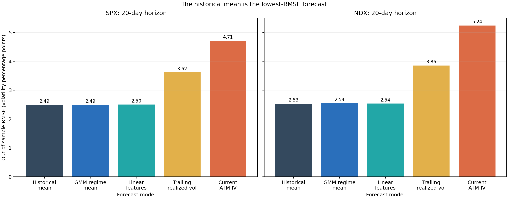
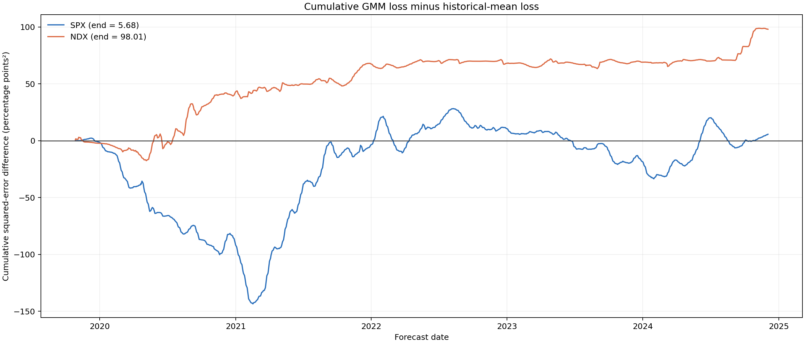

# Volatility regimes are easy to find. Forecast value is harder.

An option surface rarely moves as one number. At-the-money implied volatility can rise while the skew steepens, the wings change shape, and short maturities reprice faster than longer ones. Calling the whole episode “high volatility” throws away most of that structure.

This project asks a narrower question: if I compress the daily SPX and NDX option surfaces into a small feature vector, can latent states improve forecasts of the next 20 trading days of realized volatility?

The code has two parts. A descriptive pipeline finds states in the complete sample. A walk-forward pipeline refits on past data, predicts one block at a time, and compares a regime forecast with current at-the-money implied volatility, the expanding historical mean, trailing realized volatility, and linear regression. Keeping those parts separate matters. A clean cluster plot is evidence that the surface has structure. It is not evidence that the structure forecasts anything.

The repository ships portable demo data for 3,912 trading days from 2010-01-04 through 2024-12-31. The results below describe that tracked sample. They should not be read as a production study based on independently sourced vendor history.

## A daily surface in seven numbers

Let $\sigma_t(\Delta,\tau)$ denote annualized implied volatility on trade date $t$, at signed option delta $\Delta$ and maturity $\tau$. Delta is a scale-free coordinate: a 25-delta option occupies a comparable part of the surface even when the index level changes.

For each date, the feature builder chooses the expiry nearest 30 days inside a 15-to-45-day bucket and the expiry nearest 90 days inside a 45-to-120-day bucket. It linearly interpolates along delta, then records seven values:

$$
\begin{aligned}
\mathrm{ATM}_{t,\mathrm{near}} &= \sigma_t(-0.50,\tau_{\mathrm{near}}), \\
\mathrm{ATM}_{t,\mathrm{mid}} &= \sigma_t(-0.50,\tau_{\mathrm{mid}}), \\
\mathrm{Skew}_{t,\tau} &= \sigma_t(-0.25,\tau)-\sigma_t(+0.25,\tau), \\
\mathrm{Butterfly}_{t,\tau} &= \frac{\sigma_t(-0.25,\tau)+\sigma_t(+0.25,\tau)}{2}-\sigma_t(-0.50,\tau), \\
\mathrm{TermSlope}_t &= \mathrm{ATM}_{t,\mathrm{mid}}-\mathrm{ATM}_{t,\mathrm{near}}.
\end{aligned}
$$

Here, $\mathrm{ATM}$ means at-the-money implied volatility, $\mathrm{Skew}$ measures how much richer the put wing is than the call wing, and $\mathrm{Butterfly}$ is a simple curvature proxy. The near and mid values of ATM, skew, and butterfly contribute six features. The term slope is the seventh.

The interpolation is deliberately modest. If the requested delta lies outside the observed range, the function returns a missing value instead of extrapolating a wing it cannot see.

```python
delta_fraction = (target_delta - delta_low) / (delta_high - delta_low)
interpolated_iv = iv_low + (iv_high - iv_low) * delta_fraction

skew_value = put_wing_iv - call_wing_iv
butterfly_value = 0.5 * (put_wing_iv + call_wing_iv) - atm_iv
term_slope = atm_iv_mid - atm_iv_near
```

## What the latent state model does

Each feature column is standardized using its mean and standard deviation. The descriptive chart uses full-sample estimates. Every walk-forward fit estimates the scale from its training window only. Let $x_t$ be the resulting $d$-dimensional feature vector. The full descriptive model has $d=7$, while the default forecast uses $d=3$: near ATM, mid ATM, and their term slope. A Gaussian Mixture Model (GMM) with $K$ components assigns density

$$
p(x_t)=\sum_{k=1}^{K}\pi_k\,\mathcal{N}(x_t\mid\mu_k,\Sigma_k),
$$

where $\pi_k$ is the probability weight of component $k$, $\mu_k$ is its mean vector, $\Sigma_k$ is its full covariance matrix, and $\mathcal{N}$ is the multivariate normal density.

The code fits candidate counts from $K=2$ through $K=6$. It selects the smallest Bayesian information criterion (BIC):

$$
\mathrm{BIC}_K=-2\ell_K+p_K\log n,
$$

where $\ell_K$ is the fitted log-likelihood, $p_K$ is the number of estimated parameters, and $n$ is the number of daily observations. With full covariance matrices in $d$ dimensions, the parameter count is

$$
p_K=(K-1)+Kd+K\frac{d(d+1)}{2}.
$$

The three terms count independent mixture weights, component means, and unique covariance entries. The penalty prevents likelihood from rewarding extra states without limit. The descriptive pipeline considers $K=2,\ldots,6$. The walk-forward configuration considers $K\in\{2,3\}$ inside each training window.

Mixture labels have no natural order, so the project sorts them by mean near-term ATM implied volatility. Regime 0 is the lowest implied-volatility state. Larger labels indicate successively higher average ATM implied volatility. The ordering improves interpretation, but it does not turn an unsupervised cluster into a risk forecast.


The full-sample SPX fit selects five components. The state colours follow the large level cycles in the portable data, and the labels separate ATM implied volatility almost mechanically. This is expected because near-term ATM implied volatility is the first model input and the ordering variable.

## The forecast target, step by step

Let $P_t$ be the index close on trading day $t$. First compute the daily log return:

$$
r_t=\log\left(\frac{P_t}{P_{t-1}}\right).
$$

For a horizon of $h$ trading days, collect the future returns $r_{t+1},\ldots,r_{t+h}$ and calculate their sample standard deviation:

$$
s_t(h)=\operatorname{std}\left(r_{t+1},\ldots,r_{t+h}\right).
$$

Finally, let $A$ be the number of trading days used for annualization. The project uses $A=252$, so forward realized volatility is

$$
\mathrm{RV}_t(h)=s_t(h)\sqrt{A}.
$$

The default horizon is $h=20$. Every quantity in the calculation is a decimal. A value of $0.15$ means 15 percent annualized volatility.

For a predicted ordered state $z_t$, the regime model forecasts the training-sample mean target in that state. Let $\mathcal{T}_t$ be the set of training dates available before forecast date $t$. Then

$$
\widehat{\mathrm{RV}}^{\mathrm{regime}}_t
=
\frac{
\sum_{u\in\mathcal{T}_t}\mathbf{1}\{z_u=z_t\}\mathrm{RV}_u(h)
}{
\sum_{u\in\mathcal{T}_t}\mathbf{1}\{z_u=z_t\}
},
$$

where $\mathbf{1}\{\cdot\}$ equals one when its condition is true and zero otherwise. This forecast is intentionally simple. Any gain has to come from state membership, not from a flexible forecasting layer hidden behind it.

## The embargo that makes the split honest

A chronological split can still leak. The label attached to a training date $t$ uses returns through $t+h$. If the test window begins before that target window ends, the model trains on returns belonging to the test period.

Let $i(d)$ be the integer position of date $d$ in the sorted price history, and let $s$ be the first test date. A training label is safe only when

$$
i(t)+h<i(s).
$$

The engine removes every training row that fails this inequality. With a 20-day target, that creates a 20-trading-day gap between the last usable training label and the first test observation.

```python
test_start_position = price_date_positions[test_index[0]]
safe_train_dates = []

for train_date in train_index:
    forward_window_end = price_date_positions[train_date] + horizon
    if forward_window_end < test_start_position:
        safe_train_dates.append(train_date)
```

This detail does more for credibility than another state model. Without it, an expanding window looks causal while its labels quietly cross the boundary.

## Fixing an experiment that could not start

The original default requested 3,880 training rows. Each symbol has 3,912 complete feature rows. The 20-day forward target removes the last 20 rows, and the trailing realized-volatility benchmark needs 20 past returns at the beginning. The common evaluation panel therefore contains 3,872 rows, fewer than the requested training window even before the embargo.

Silent empty CSV files were the wrong behavior. The corrected contract defines `min_train_size` as the number of labelled rows left after embargo. Its new value is 2,520, approximately ten trading years. Early candidate splits are skipped until 2,520 safe labels exist. A preflight also computes the maximum safe history that can leave one test row. An impossible request now raises an error with the aligned count, safe maximum, and requested minimum.

All five dates in a test block share one fixed training window. The linear and GMM models now fit once for that block, then score all five rows. This removes redundant fitting without changing the information set or predictions. The first valid forecast is 2019-10-28. The final one is 2024-12-03 because the remaining December dates do not yet have a complete 20-day future target.

## Measuring forecast loss

Let $y_t$ be realized volatility and $\hat y_{m,t}$ be model $m$'s forecast on date $t$. For $N$ forecast dates, define the error $e_{m,t}=y_t-\hat y_{m,t}$. Mean squared error (MSE), root mean squared error (RMSE), and mean absolute error (MAE) are

$$
\begin{aligned}
\mathrm{MSE}_m &= \frac{1}{N}\sum_{t=1}^{N}e_{m,t}^2, \\
\mathrm{RMSE}_m &= \sqrt{\mathrm{MSE}_m}, \\
\mathrm{MAE}_m &= \frac{1}{N}\sum_{t=1}^{N}|e_{m,t}|.
\end{aligned}
$$

RMSE and MAE have the same annualized decimal unit as the target. The chart multiplies them by 100, so 0.024924 becomes 2.4924 volatility percentage points.

For benchmark $b$, the relative out-of-sample score is

$$
R^2_{\mathrm{OOS},m\mid b}=1-\frac{\mathrm{MSE}_m}{\mathrm{MSE}_b}.
$$

A positive value means model $m$ has lower squared error than benchmark $b$ on identical dates. The report calculates this score against current ATM implied volatility and against the expanding historical mean. The second comparison is the harder one: it asks whether the model adds information beyond the unconditional target level observed so far.

## The corrected result

The default run produces 1,332 forecasts per symbol at a 20-day horizon. Each training window selects $K$ by BIC from $\{2,3\}$. SPX uses two states on 1,022 forecast dates and three on 310. NDX uses two on 1,012 dates and three on 320.

| Symbol | Model | RMSE (pp) | MAE (pp) | $R^2_{\mathrm{OOS}}$ vs historical mean |
|:--|:--|--:|--:|--:|
| SPX | Historical mean | 2.4924 | 2.0243 | 0.0000 |
| SPX | GMM regime mean | 2.4932 | 2.0305 | -0.0007 |
| SPX | Linear features | 2.4999 | 2.0342 | -0.0061 |
| SPX | Trailing realized volatility | 3.6150 | 2.8981 | -1.1038 |
| SPX | Current ATM IV | 4.7103 | 3.9488 | -2.5717 |
| NDX | Historical mean | 2.5297 | 2.0374 | 0.0000 |
| NDX | GMM regime mean | 2.5442 | 2.0491 | -0.0115 |
| NDX | Linear features | 2.5355 | 2.0336 | -0.0046 |
| NDX | Trailing realized volatility | 3.8561 | 3.0798 | -1.3235 |
| NDX | Current ATM IV | 5.2400 | 4.3312 | -3.2907 |



The regime mean cuts RMSE sharply relative to current ATM implied volatility, but the expanding historical mean is marginally better for both symbols. SPX differs by 0.0008 percentage points of RMSE. The NDX gap is 0.0145 percentage points. Linear regression is also close. In this sample, surface structure does not improve the pooled squared-error forecast beyond a slowly updated unconditional mean.

That comparison also changes how I read the ATM result. Implied volatility is a risk-neutral price with a variance-risk premium, while realized volatility is a physical outcome. The near option bucket targets roughly 30 calendar days and the forecast target covers 20 trading days. A large ATM error does not prove an exploitable mispricing, and beating ATM does not isolate regime information.



The cumulative loss difference uses squared errors in percentage-point units. A falling line favours GMM. A rising line favours the historical mean. SPX gains substantially during part of 2020 and 2021, then gives the advantage back and ends at +5.68 squared percentage points. NDX ends at +98.01. The path is unstable even where the final SPX difference is tiny.

## What the result does and does not establish

The central hypothesis fails on the portable demo sample under this configuration. GMM regimes describe the option surface cleanly, yet their conditional target means do not beat the expanding historical mean from 2019-10-28 through 2024-12-03.

The conclusion is narrow for four reasons. First, the tracked Parquet files are teaching data, not independently verified vendor history. Second, the run tests one 20-day horizon and the three-column `atm_term` feature set. Third, adjacent targets share 19 of 20 returns, so 1,332 daily errors are not 1,332 independent observations. The report gives point estimates and no overlap-adjusted inference. Fourth, BIC state selection and model parameters are re-estimated every five dates. This is computationally costly, and the result may depend on the refit schedule.

A production study should freeze the design before inspecting losses, test the registered feature sets and several horizons, and report non-overlapping block results or heteroskedasticity-and-autocorrelation-consistent uncertainty. It should also check calibration on real option quotes, including quote quality, delta conventions, expiry interpolation, and the distinction between implied and physical volatility.

## Primary references

- Dempster, Laird, and Rubin (1977), [“Maximum Likelihood from Incomplete Data via the EM Algorithm”](https://doi.org/10.1111/j.2517-6161.1977.tb01600.x), for expectation-maximization estimation.
- Schwarz (1978), [“Estimating the Dimension of a Model”](https://doi.org/10.1214/aos/1176344136), for the Bayesian information criterion.
- Andersen, Bollerslev, Diebold, and Labys (2003), [“Modeling and Forecasting Realized Volatility”](https://doi.org/10.1111/1468-0262.00418), for realized-volatility measurement and forecasting.
- Campbell and Thompson (2008), [“Predicting Excess Stock Returns Out of Sample: Can Anything Beat the Historical Average?”](https://doi.org/10.1093/rfs/hhm055), for the historical-average benchmark and relative out-of-sample $R^2$ framing.

The useful finding is the failed comparison. Once the unconditional mean enters the panel, the apparent regime advantage disappears.
